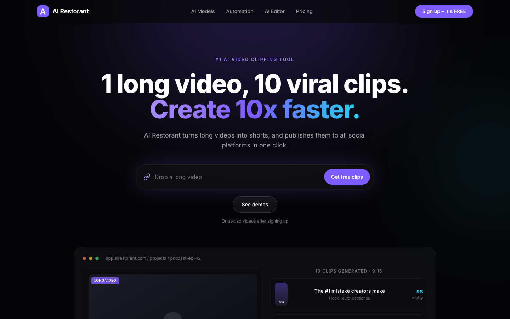
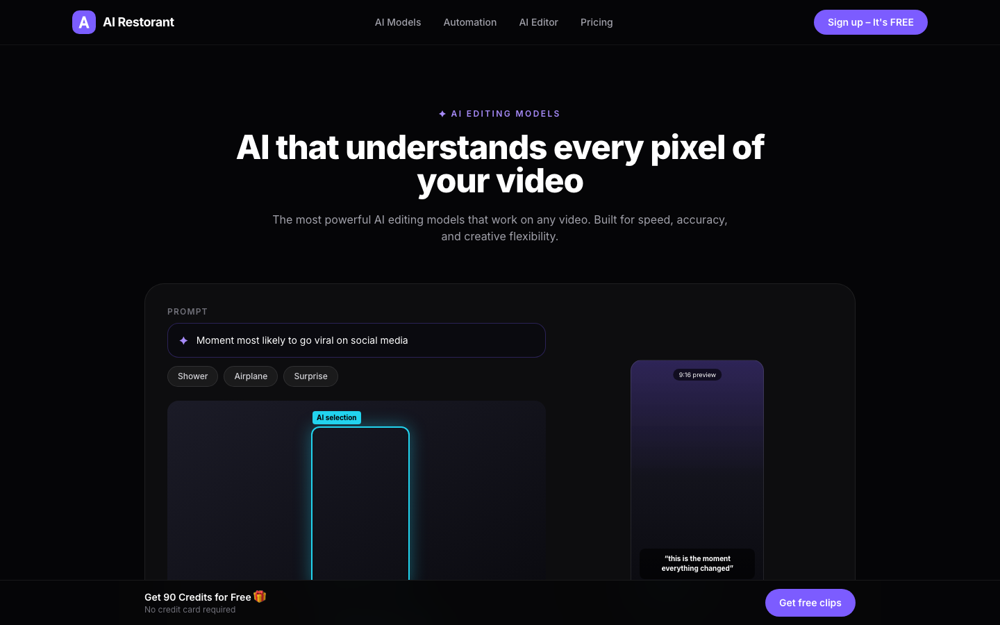
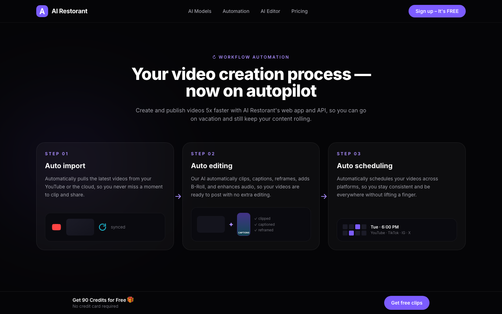
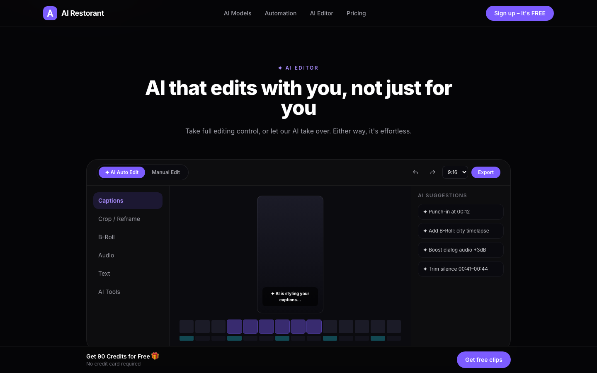
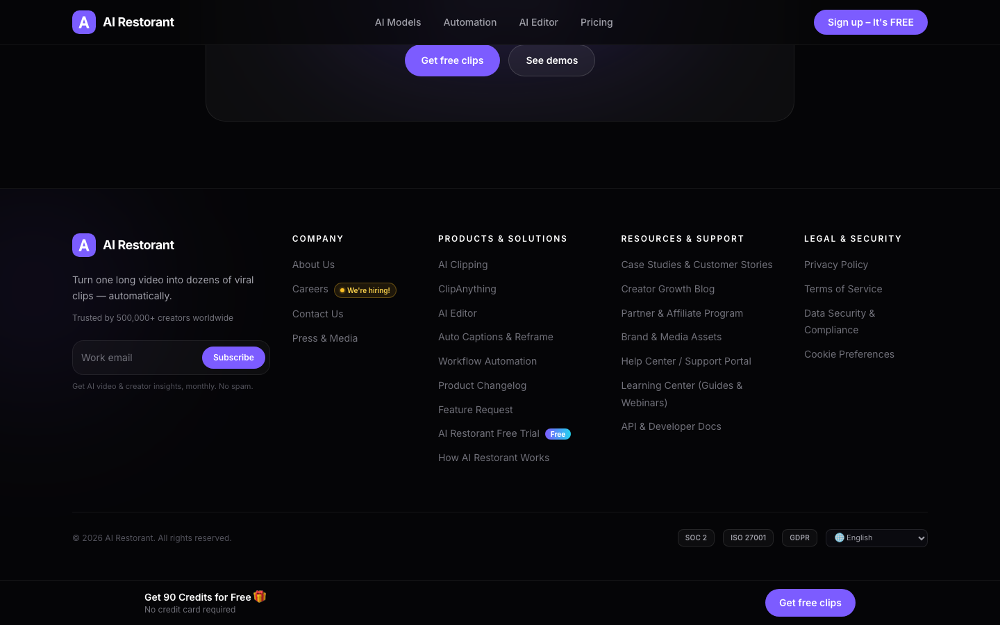
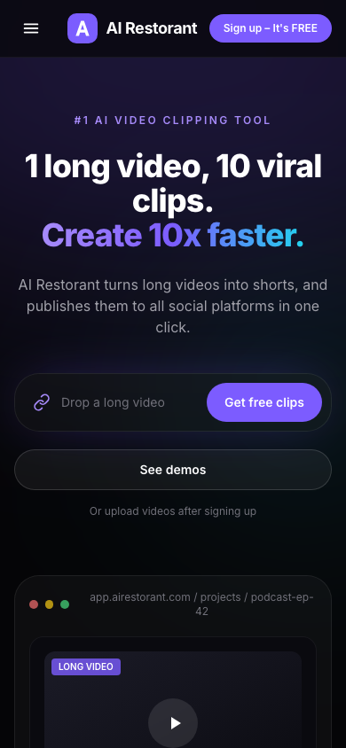

# AI Restorant

**1 long video, 10 viral clips. Create 10x faster.**

AI Restorant is a working AI video clipping MVP: upload a video (or paste a YouTube link), and a real pipeline — Whisper transcription → Claude moment selection → FFmpeg rendering — produces vertical 9:16 clips with burned-in captions that you can preview and download. Wrapped in a premium dark SaaS UI.



## ⚙️ How the pipeline works

```
Upload / YouTube URL → job queue → extract audio (ffmpeg)
  → transcribe with timestamps (whisper.cpp)
  → Claude selects the best self-contained moments (structured JSON + schema validation)
  → ffmpeg cuts each segment, converts to 1080×1920 (9:16), burns ASS captions
  → preview in the browser · download MP4 / ZIP
```

The pipeline requires local binaries (see **Requirements**) and runs on the Next.js server — the deployed Vercel site serves the UI, but processing requires a host with ffmpeg/whisper installed. `/api/health` reports honestly which dependencies are available.

## 📋 Requirements (processing host)

- `ffmpeg` **with libass** (`brew install ffmpeg-full`) and `ffprobe`
- `whisper-cli` (whisper.cpp) + a ggml model (e.g. `ggml-small.bin`)
- `yt-dlp` for YouTube ingestion
- `ANTHROPIC_API_KEY` for clip selection
- Copy `.env.example` → `.env.local` and fill in paths/keys

## ✨ Features

- **Hero with product mockup** — upload box, CTA pair, and a realistic dashboard mockup showing a long video being turned into scored 9:16 clips with publish targets (YouTube, TikTok, Instagram, LinkedIn, Facebook, X)
- **AI Editing Models** — prompt-driven showcase ("Moment most likely to go viral on social media") with AI selection highlight, timeline frames, and a vertical 9:16 preview, plus the **ClipAnything** pitch
- **Workflow Automation** — Auto Import → Auto Editing → Auto Scheduling, connected steps that collapse into a vertical timeline on mobile
- **Interactive AI Editor** — switch between *AI Auto Edit* and *Manual Edit* modes, live aspect-ratio switcher (9:16 / 1:1 / 4:5 / 16:9), timeline, tool sidebar, and AI suggestions panel
- **Conversion-focused CTAs** — "Get 90 Credits for Free 🎁" card plus a sticky bottom CTA that appears on scroll
- **Premium footer** — four-category information architecture with "We're hiring!" and "Free" badges, newsletter signup, SOC 2 / ISO 27001 / GDPR trust badges, and a language switcher
- **Motion** — IntersectionObserver fade-ins, hover lift + glow on cards, micro-interactions on every button
- **Fully responsive** — no horizontal overflow from 375px up

## 📸 Screenshots

| AI Editing Models | Workflow Automation |
| --- | --- |
|  |  |

| Interactive AI Editor | Footer |
| --- | --- |
|  |  |

<details>
<summary>📱 Mobile view</summary>



</details>

## 🛠 Tech Stack

- [Next.js 14](https://nextjs.org/) (App Router, static output)
- [TypeScript](https://www.typescriptlang.org/)
- [Tailwind CSS 3](https://tailwindcss.com/)
- Zero client-side dependencies beyond React — animations are plain CSS + IntersectionObserver

## 🚀 Getting Started

```bash
npm install
npm run dev
```

Open [http://localhost:3789](http://localhost:3789).

Production build:

```bash
npm run build
npm start
```

## 📁 Project Structure

```
app/
  layout.tsx        # metadata + global shell
  page.tsx          # section composition
  globals.css       # design tokens, glass/button utilities, reveal animation
components/
  Navbar.tsx        # sticky blurred navbar with mobile hamburger
  Hero.tsx          # headline + UploadBox + ProductPreview
  UploadBox.tsx     # video link input with CTA
  ProductPreview.tsx# dashboard mockup with clips & platforms
  AIEditingModels.tsx / ClipAnything.tsx
  WorkflowAutomation.tsx / WorkflowStep.tsx
  AIEditor.tsx      # interactive editor demo (client component)
  CTA.tsx           # credits card + sticky bottom bar
  Footer.tsx        # 4-category footer with badges & trust signals
  Reveal.tsx        # scroll-into-view fade wrapper
  Logo.tsx          # gradient "A" mark
```

## 📄 License

© 2026 AI Restorant. All rights reserved.
